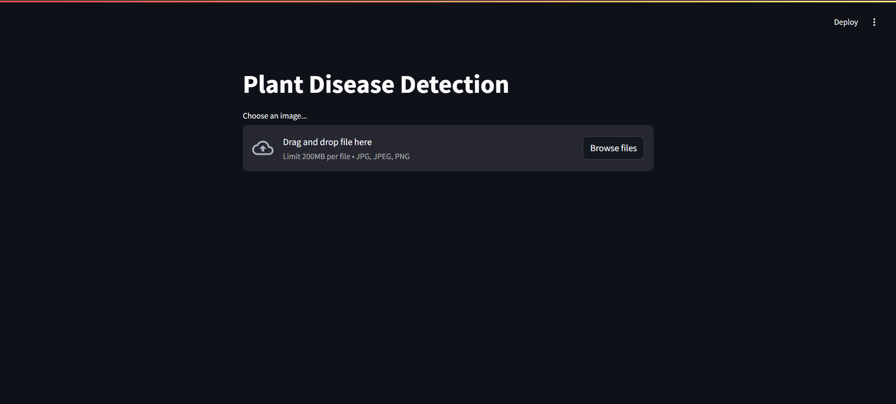
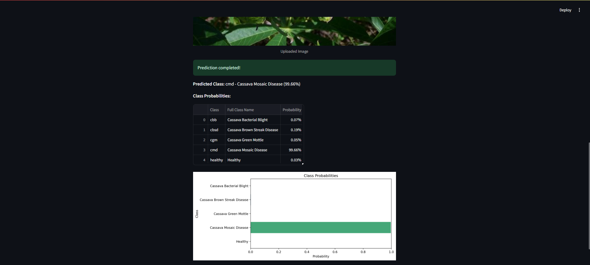
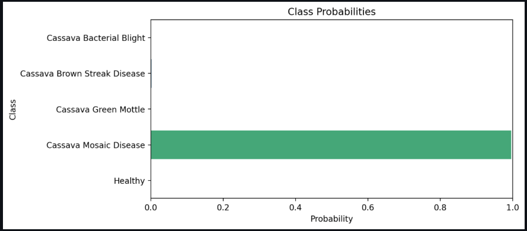

# Cassava Plant Disease Detection

## Table of Contents
1. [Project Overview](#project-overview)
2. [Dataset](#dataset)
3. [Project Structure](#project-structure)
4. [Installation](#installation)
5. [Usage](#usage)
    - [Training the Models](#training-the-models)
    - [Deploying the Application](#deploying-the-application)
6. [Models](#models)
7. [Results](#results)
8. [Application](#application)
9. [Contributing](#contributing)
10. [License](#license)
11. [Acknowledgments](#acknowledgments)

---

## Project Overview

Cassava (Manihot esculenta) is a staple food crop in many tropical and subtropical regions, providing essential carbohydrates for millions of people. However, cassava crops are vulnerable to various diseases that can significantly impact yield and quality. Early detection and accurate classification of these diseases are crucial for effective crop management and minimizing losses.

This project leverages deep learning techniques, specifically convolutional neural networks (CNNs), to develop an automated system for detecting and classifying cassava plant diseases from leaf images. Utilizing the ResNet50 architecture, both baseline and enhanced models are trained to identify five classes of cassava leaf conditions:

1. **cbb**: Cassava Bacterial Blight
2. **cbsd**: Cassava Brown Streak Disease
3. **cgm**: Cassava Green Mottle
4. **cmd**: Cassava Mosaic Disease
5. **healthy**: Healthy leaves

An interactive web application built with Streamlit allows users to upload leaf images and receive real-time disease classification results.

---

## Dataset

### Source
The dataset used in this project is based on the [Cassava Leaf Disease Classification](https://arxiv.org/pdf/1908.02900.pdf) research, which provides a comprehensive collection of cassava leaf images categorized into different disease classes.

### Classes and Descriptions

- **cbb (Cassava Bacterial Blight)**: A bacterial infection causing wilting, necrosis, and yellowing of leaves.
- **cbsd (Cassava Brown Streak Disease)**: A viral disease marked by brown streaks on leaves and stems.
- **cgm (Cassava Green Mottle)**: A viral infection leading to mottle patterns and green discoloration on leaves.
- **cmd (Cassava Mosaic Disease)**: A viral disease causing mosaic-like patterns, leaf distortion, and chlorosis.
- **healthy**: Leaves showing no signs of disease.

### Dataset Statistics

| Class    | Number of Images |
|----------|-------------------|
| cbb      | 466               |
| cbsd     | 1,443             |
| cgm      | 773               |
| cmd      | 2,658             |
| healthy  | 316               |
| **Total**| **5,656**         |

### Project Structure

```
cassava-disease-detection/
├── data/
│   ├── test/
│   ├── train/
│   │   ├── cbb/
│   │   ├── cbsd/
│   │   ├── cgm/
│   │   ├── cmd/
│   │   └── healthy/
├── env/
├── models/
│   ├── enhanced_resnet50_cassava.pth
│   └── resnet50_cassava.pth
├── app.py
├── main.ipynb
├── requirements.txt
└── README.md
```

- **data/**: Contains the training and testing images organized by class.
- **env/**: Virtual environment directory with project dependencies.
- **models/**: Stores trained model weights for both baseline and enhanced models.
- **app.py**: Streamlit application script for deploying the disease detection model.
- **main.ipynb**: Jupyter Notebook for data preparation, model training, and evaluation.
- **requirements.txt**: Lists all Python dependencies required for the project.
- **README.md**: Project documentation.

---

## Installation

### Prerequisites

- Python 3.7 or higher
- Git
- CUDA-enabled GPU (optional, for faster training)

### Clone the Repository

```bash
git clone https://github.com/your_username/cassava-disease-detection.git
cd cassava-disease-detection
```

### Set Up Virtual Environment

It's recommended to use a virtual environment to manage dependencies.

#### Using `venv`:

```bash
python -m venv env
```

#### Activate the Virtual Environment

- **Windows:**

  ```bash
  env\Scripts\activate
  ```

- **macOS/Linux:**

  ```bash
  source env/bin/activate
  ```

### Install Dependencies

```bash
pip install -r requirements.txt
```

*Ensure that `requirements.txt` includes all necessary packages, such as `torch`, `torchvision`, `streamlit`, `pandas`, `numpy`, `matplotlib`, `seaborn`, and `scikit-learn`.*

---

## Usage

### Training the Models

The `main.ipynb` Jupyter Notebook contains all the code required for data preparation, training the baseline and enhanced models, and evaluating their performance.

1. **Open the Notebook:**

   ```bash
   jupyter notebook main.ipynb
   ```

2. **Run the Notebook Cells:**

   - **Data Preparation:** Preprocess and visualize the dataset.
   - **Baseline Model:** Train and evaluate the baseline ResNet50 model.
   - **Enhanced Model:** Train and evaluate the enhanced ResNet50 model with additional layers and fine-tuning.

3. **Model Saving:**

   - The trained models are saved in the `models/` directory as `resnet50_cassava.pth` (baseline) and `enhanced_resnet50_cassava.pth` (enhanced).

### Deploying the Application

The `app.py` script utilizes Streamlit to create an interactive web application for disease detection.

1. **Ensure Models are Trained and Saved:**

   - Confirm that both `resnet50_cassava.pth` and `enhanced_resnet50_cassava.pth` are present in the `models/` directory.

2. **Run the Streamlit App:**

   ```bash
   streamlit run app.py
   ```

3. **Interact with the Application:**

   - Open the provided local URL (e.g., `http://localhost:8501`) in your web browser.
   - Upload an image of a cassava leaf.
   - View the predicted disease class along with probabilities for each class.

---

## Models

### Baseline Model

- **Architecture:** ResNet50 with pre-trained weights on ImageNet.
- **Modifications:**
  - All convolutional layers are frozen.
  - The final fully connected layer is replaced with a new linear layer matching the number of classes (5).
- **Training Details:**
  - **Optimizer:** Adam with a learning rate of 0.001.
  - **Loss Function:** Cross-Entropy Loss.
  - **Epochs:** 10
- **Performance:**
  - **Validation Accuracy:** 76.68%
  - **Validation Loss:** 0.6905
  - **Precision:** 0.7614
  - **Recall:** 0.7691
  - **F1 Score:** 0.7580

### Enhanced Model

- **Architecture:** ResNet50 with pre-trained weights on ImageNet.
- **Modifications:**
  - All layers are unfrozen for fine-tuning.
  - The classifier is enhanced with additional layers:
    - Linear layer with 512 neurons.
    - Batch Normalization.
    - ReLU activation.
    - Dropout with a probability of 0.5.
    - Final linear layer matching the number of classes (5).
- **Training Details:**
  - **Optimizer:** Adam with a learning rate of 0.0001.
  - **Loss Function:** Cross-Entropy Loss.
  - **Scheduler:** StepLR reducing the learning rate by a factor of 0.1 every 5 epochs.
  - **Epochs:** 10
- **Performance:**
  - **Validation Accuracy:** 86.45%
  - **Validation Loss:** 0.4705

*Note: Precision, Recall, and F1-score for the enhanced model were not provided in the outputs.*

---

## Results

### Baseline Model Performance

- **Training Loss:** Decreased steadily over epochs.
- **Validation Loss:** Showed a general downward trend with minor fluctuations.
- **Validation Accuracy:** Improved steadily, stabilizing around 76.68%.

### Enhanced Model Performance

- **Training Loss:** Rapid decrease indicating effective learning.
- **Validation Loss:** Decreased consistently, suggesting better generalization.
- **Validation Accuracy:** Achieved a higher performance level, stabilizing around 86.45%.

### Comparative Analysis

- **Validation Accuracy:** Enhanced model outperformed the baseline by approximately 10%.
- **Validation Loss:** Enhanced model achieved lower validation loss, indicating better performance.

---

## Application

### Streamlit Web Application

The Streamlit application provides an easy-to-use interface for uploading cassava leaf images and obtaining disease classification results.

#### Features

- **Image Upload:** Users can upload images in JPG, JPEG, or PNG formats.
- **Real-time Prediction:** The application processes the uploaded image and displays the predicted disease class along with probabilities for each class.
- **Visualization:** A bar chart visualizes the probability distribution across all classes, enhancing interpretability.

#### Screenshots

- **Main Interface:**

  
  
  *Description:* The main interface of the Streamlit application, allowing users to upload cassava leaf images for disease detection.

- **Prediction Result:**

  
  
  *Description:* The application displays the uploaded image along with the predicted disease class, its full name, and the associated probability.

- **Class Probabilities:**

  
  
  *Description:* A detailed table and bar chart showing the probability distribution across all classes for the uploaded image.

---

## Contributing

Contributions are welcome! If you have suggestions for improvements or encounter any issues, feel free to open an issue or submit a pull request.

1. **Fork the Repository**
2. **Create a New Branch**

   ```bash
   git checkout -b feature/YourFeatureName
   ```

3. **Commit Your Changes**

   ```bash
   git commit -m "Add your message here"
   ```

4. **Push to the Branch**

   ```bash
   git push origin feature/YourFeatureName
   ```

5. **Open a Pull Request**

---
## Acknowledgments

- **Dataset Contributors:** Special thanks to the authors of the [Cassava Leaf Disease Classification](https://arxiv.org/pdf/1908.02900.pdf) paper for providing the valuable dataset.
- **Open-Source Libraries:** Appreciation to the developers of PyTorch, Streamlit, Seaborn, and other libraries utilized in this project.
- **Community Support:** Grateful for the support and feedback from the developer community.

---
